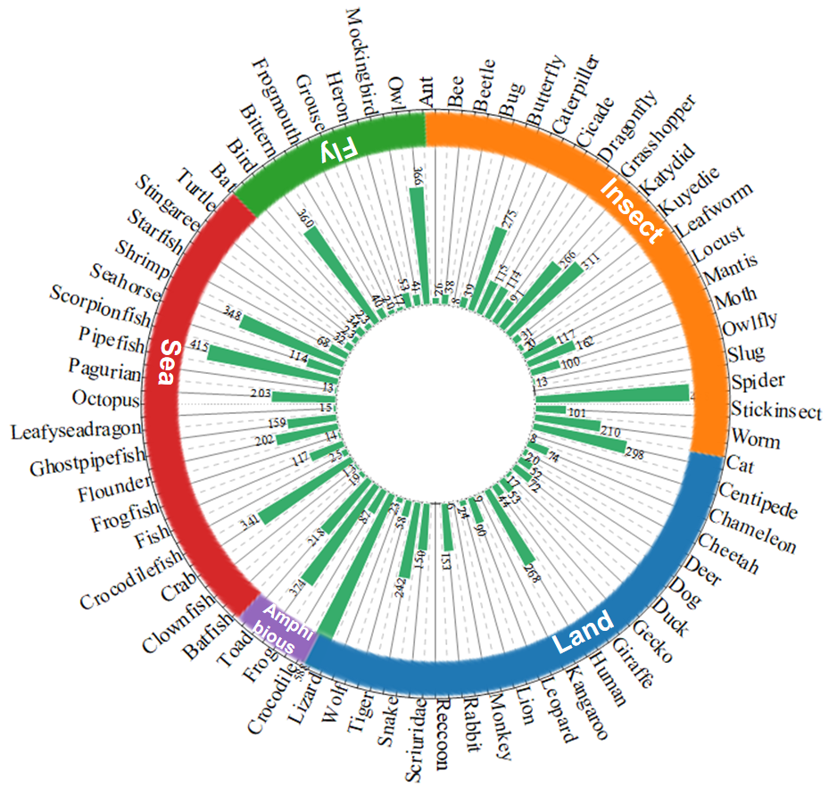
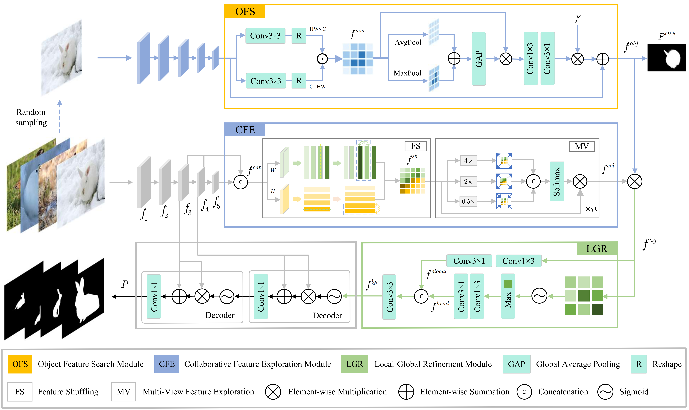

# 
`Collaborative Camouflaged Object Detection: A Large-Scale Dataset and Benchmark (IEEE TNNLS)`

> **Authors:** 
> [Cong Zhang](https://github.com/zc199823/), Hong-Bp Bi, [Tian-Zhu Xiang](https://github.com/visionxiang), [Ran-Wan Wu](https://github.com/RanwanWu/), Jinghui Tong, Xiufang Wang

## 1. CoCOD8K

-We propose the first large-scale and challenging CoCOD dataset, termed CoCOD8K, which contains 8,528 high-resolution camouflaged images paired with corresponding binary mask annotations. This work provides a foundation for the CoCOD field and is expected to give a strong boost to growth in the COD community.

-Illustration of collaborative camouflaged object detection. 
  
   Figure 1:  Five image groups are from the proposed CoCOD8K datasets, which are (a) crawling insects, (b) cats, (c) toads, (d) frogfish, and (e) owls, respectively. 

      
    <em> 
    Figure 2:  Taxonomic structure of our proposed dataset, which illustrates the histogram distribution for the 5 super-classes and 70 sub-classes in our CoCOD8K.
    </em>

CoCOD8K can be download from [here](https://pan.quark.cn/s/5bdc87f4e0c0)[code:tdYx].

## 2. Overview

      
    <em> 
    Figure 3: An overview of our proposed BBNet. Specifically, our model contains three main modules, i.e., collaborative feature extraction (CFE), object feature search (OFS), and local-global refinement (LGR). The CFE and OFS modules are designed to explore subtle camouflaged object cues (f^{col} and f^{obj} ) from within image groups and within images, respectively. These two features are then integrated, and the LGR module is devised to enhance the representation of co-camouflaged features from both global and local perspectives. Combining the co-camouflaged feature (f^{lgr}) with backbone features (f3 and f4) via two simple decoders, the model provides accurate camouflaged object predictions from the given images. ×n denotes n iterations.).
    </em>

## 3. Proposed Framework
### 3.1 Training/Testing
The training and testing experiments are conducted using PyTorch with a single GeForce NVIDIA GTX 1080 Ti of 5 GB Memory.

1. Prerequisites:

Note that BBNet is only tested on Ubuntu OS with the following environments. It may work on other operating systems (i.e., Windows) as well but we do not guarantee that it will.

 + Creating a virtual environment in terminal: `conda create -n BBNet python=3.6`.
 +  Installing necessary packages: [PyTorch > 1.1](https://pytorch.org/), [opencv-python](https://pypi.org/project/opencv-python/)

2. Prepare the data:
   + downloading testing dataset and moving it into `./Dataset/TestDataset/`.

    + downloading training/validation dataset and move it into `./Dataset/TrainDataset/`.
    
    + downloading pre-trained weights and move it into `./pth/BBNet_pth.59`, 
    which can be found in [here](https://pan.quark.cn/s/745d6a2983b0).
    
    + downloading Res2Net weights on ImageNet dataset [download link](https://pan.quark.cn/s/617987709421).

3. Training Configuration:

    + Assigning your costumed path, like `--train_save` and `--train_path` in `train.py`.
    
    + Just enjoy it via run `python train.py` in your terminal.

4. Testing Configuration:

    + After you download all the pre-trained models and testing datasets, just run `test.py` to generate the final prediction map: 
    replace your trained model directory (`--pth`).
    
    + Just enjoy it!

### 4.2 Evaluating your trained model:
You can evaluate the result maps using the tool from [here](https://pan.quark.cn/s/e5f0148f77f5)

## 5. Citation

If you find this project useful, please consider citing:
    
    @article{zhang2023collaborative,
    title={Collaborative Camouflaged Object Detection: A Large-Scale Dataset and Benchmark},
    author={Zhang, Cong and Bi, Hongbo and Xiang, Tian-Zhu and Wu, Ranwan and Tong, Jinghui and Wang, Xiufang},
    journal={arXiv preprint arXiv:2310.04253},
    year={2023}
    }

    

