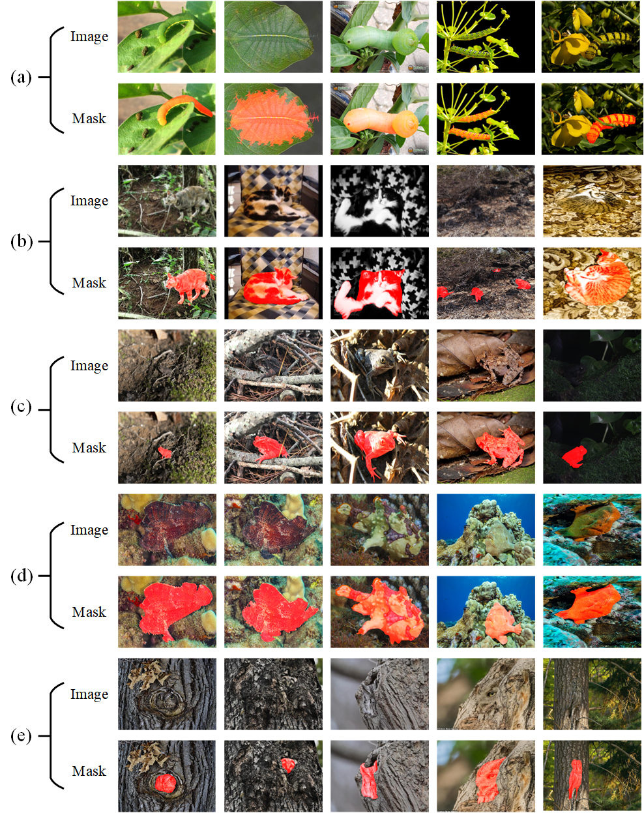

# 
`Collaborative Camouflaged Object Detection: A Large-Scale Dataset and Benchmark (IEEE TNNLS)`

> **Authors:** 
> [Cong Zhang](https://github.com/zc199823/), Hong-Bp Bi, [Tian-Zhu Xiang](https://github.com/visionxiang), [Ran-Wan Wu](https://github.com/RanwanWu/), Jinghui Tong, Xiufang Wang

## 1. CoCOD8K

-We propose the first large-scale and challenging CoCOD dataset, termed CoCOD8K, which contains 8,528 high-resolution camouflaged images paired with corresponding binary mask annotations. This work provides a foundation for the CoCOD field and is expected to give a strong boost to growth in the COD community.

-Illustration of collaborative camouflaged object detection. 
  
   Figure 1  Five image groups are from the proposed CoCOD8K datasets, which are (a) crawling insects, (b) cats, (c) toads, (d) frogfish, and (e) owls, respectively. 

      
    <em> 
    Figure 2:  Taxonomic structure of our proposed dataset, which illustrates the histogram distribution for the 5 super-classes and 70 sub-classes in our CoCOD8K.
    </em>

CoCOD8K can be download from here(https://pan.quark.cn/s/5bdc87f4e0c0)

## 2. Overview

      
    <em> 
    Figure 1: Task relationship. One of the most popular directions in computer vision is generic object detection. 
    Note that generic objects can be either salient or camouflaged; camouflaged objects can be seen as difficult cases of 
    generic objects. Typical generic object detection tasks include semantic segmentation and panoptic 
    segmentation (see Fig. 2 b).
    </em>

